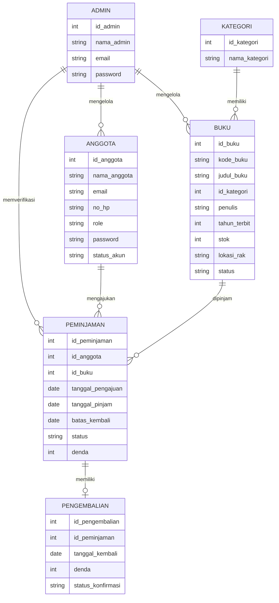
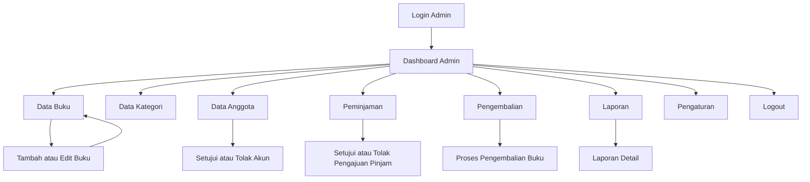
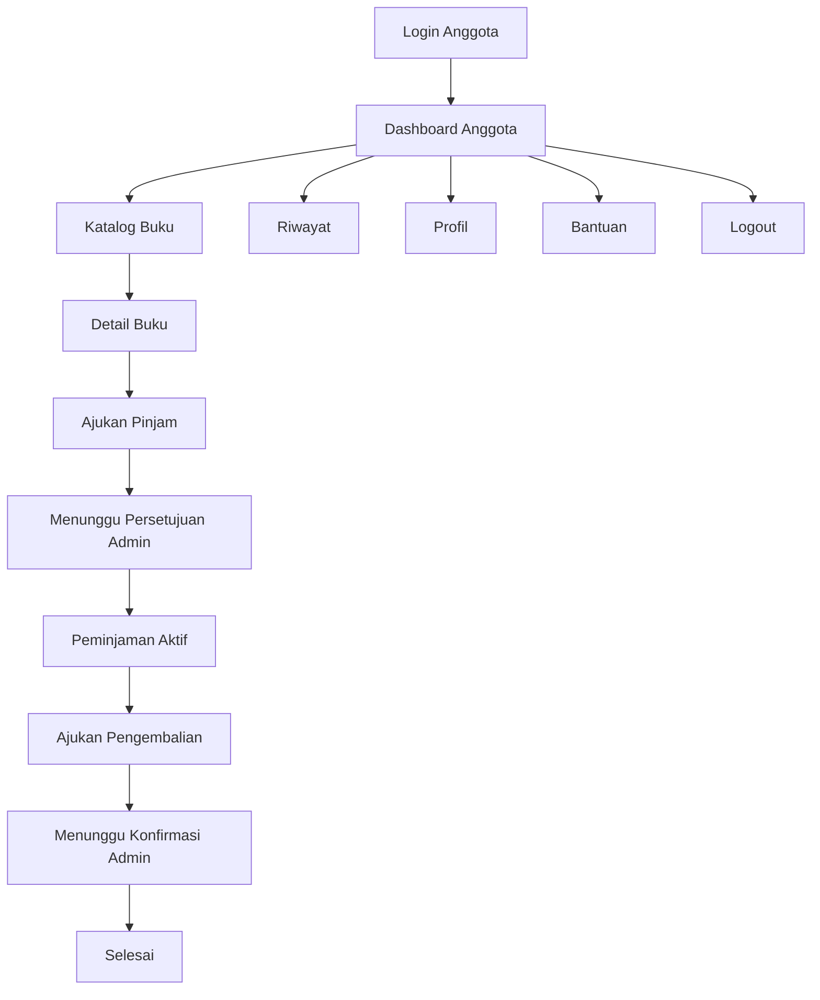

# PERANCANGAN SISTEM INFORMASI PERPUSTAKAAN BERBASIS WEB

## 1. Nama Project
**E-Library UNPAM / E-Library Admin Panel**

## 2. Link Project
- **Website / Deploy Netlify**: https://e-library-unpam1.netlify.app/
- **Repository GitHub**: https://github.com/Mas-is/e-library-admin
- **Link Figma**: https://www.figma.com/design/8lDGe5FSbMBeEAfj1JYkcC/E-Library?node-id=1-2&t=nFy6U7MnzMPo4YpF-1

## 3. Topik
Sistem Informasi Perpustakaan berbasis web untuk mengelola katalog buku fisik, anggota, peminjaman, pengembalian, denda, laporan, dan portal anggota.

## 4. Deskripsi Singkat
E-Library UNPAM adalah aplikasi web perpustakaan yang digunakan untuk mendukung administrasi buku fisik melalui sistem digital. Buku yang dikelola tetap berbentuk fisik dan berada di perpustakaan, sedangkan sistem digunakan untuk mencatat katalog, stok buku, data anggota, pengajuan peminjaman, persetujuan peminjaman, pengembalian, denda keterlambatan, dan laporan transaksi.

Konsep utama project ini bukan aplikasi membaca buku digital secara online, melainkan **katalog dan sistem sirkulasi buku fisik berbasis web**. Anggota dapat melihat katalog buku dan mengajukan peminjaman melalui portal anggota. Admin bertugas memverifikasi pengajuan, menyetujui atau menolak peminjaman, memproses pengembalian, serta mengelola data perpustakaan.

Project ini berfokus pada client-side programming. Data yang digunakan berupa mock data JavaScript dan localStorage, sehingga aplikasi dapat dijalankan langsung di browser tanpa database server.

## 5. Tujuan Sistem
1. Memudahkan admin dalam mengelola data buku fisik, kategori, anggota, peminjaman, pengembalian, dan laporan.
2. Memudahkan anggota dalam mencari buku dan mengajukan peminjaman tanpa harus mencatat manual.
3. Menyediakan alur peminjaman yang lebih tertib melalui status pengajuan dan persetujuan admin.
4. Mengurangi risiko kesalahan pencatatan stok, keterlambatan, dan denda.
5. Menyediakan simulasi sistem perpustakaan berbasis web untuk kebutuhan pembelajaran Pemrograman Web.

## 6. Ruang Lingkup Sistem
Sistem mencakup dua sisi pengguna, yaitu admin dan anggota.

### 6.1 Admin
Admin memiliki akses untuk:
- melihat dashboard statistik perpustakaan;
- mengelola data buku fisik;
- mengelola kategori buku;
- mengelola akun anggota;
- menyetujui atau menolak pendaftaran anggota;
- membuat akun anggota manual;
- memproses pengajuan peminjaman;
- memproses pengembalian buku;
- melihat laporan transaksi peminjaman;
- mengatur durasi pinjam, denda, dan informasi perpustakaan.

### 6.2 Anggota
Anggota memiliki akses untuk:
- login ke portal anggota;
- melihat dashboard anggota;
- melihat katalog buku fisik;
- mengajukan peminjaman buku;
- melihat status peminjaman;
- mengajukan pengembalian buku;
- melihat riwayat peminjaman;
- memperbarui profil anggota;
- membaca halaman bantuan penggunaan sistem.

## 7. Tema Visual
Tema visual menggunakan gaya Material Design dengan tampilan dashboard modern.

Ciri desain:
- warna utama biru;
- sidebar di sisi kiri;
- topbar berisi search, notifikasi, dan profil pengguna;
- card statistik;
- tabel data;
- form input;
- badge status;
- modal interaktif;
- katalog berbasis card;
- layout responsif untuk desktop dan perangkat mobile.

## 8. Teknologi yang Digunakan
- HTML5 untuk struktur halaman;
- CSS3 untuk desain antarmuka dan responsivitas;
- JavaScript untuk logika interaktif;
- localStorage untuk penyimpanan data lokal;
- mock data untuk simulasi database;
- Netlify untuk deployment website statis;
- GitHub untuk penyimpanan source code.

## 9. Struktur Menu

### 9.1 Menu Admin
- Dashboard
- Data Buku
- Data Kategori
- Data Anggota
- Peminjaman
- Pengembalian
- Laporan
- Pengaturan
- Logout

### 9.2 Menu Anggota
- Dashboard
- Katalog Buku
- Peminjaman Saya
- Pengembalian
- Riwayat
- Profil
- Bantuan
- Logout

## 10. Halaman yang Dibuat

### 10.1 Halaman Umum
- Login Page
- Register Page

### 10.2 Halaman Admin
- Dashboard Admin
- Data Buku
- Form Tambah Buku
- Data Kategori
- Data Anggota
- Peminjaman
- Pengembalian
- Laporan Peminjaman
- Laporan Detail
- Pengaturan
- Dokumentasi

### 10.3 Halaman Anggota
- Dashboard Anggota
- Katalog Buku
- Detail Buku
- Peminjaman Saya
- Pengembalian
- Riwayat Peminjaman
- Profil Anggota
- Bantuan Anggota

## 11. Aktor dan Hak Akses

| Aktor | Hak Akses |
|---|---|
| Admin | Mengelola seluruh data dan transaksi perpustakaan |
| Mahasiswa | Melihat katalog, mengajukan peminjaman, mengajukan pengembalian, melihat riwayat |
| Dosen | Melihat katalog, mengajukan peminjaman, mengajukan pengembalian, melihat riwayat |

## 12. Alur Sistem

### 12.1 Alur Login
1. Pengguna membuka halaman login.
2. Pengguna memilih role admin atau anggota.
3. Sistem memvalidasi email dan password.
4. Jika akun valid, pengguna diarahkan ke dashboard sesuai role.
5. Jika akun anggota masih menunggu persetujuan, sistem menolak login sampai admin menyetujui akun.

### 12.2 Alur Pendaftaran Anggota
1. Calon anggota membuka halaman register.
2. Calon anggota mengisi nama, email, role, nomor telepon, dan password.
3. Sistem menyimpan akun dengan status **Menunggu Persetujuan**.
4. Admin membuka menu Data Anggota.
5. Admin menyetujui atau menolak akun.
6. Anggota yang disetujui dapat login ke portal anggota.

### 12.3 Alur Pengajuan Peminjaman Buku Fisik
1. Anggota login ke portal anggota.
2. Anggota membuka menu Katalog Buku.
3. Anggota memilih buku yang tersedia.
4. Anggota menekan tombol **Ajukan Pinjam**.
5. Sistem membuat transaksi dengan status **Menunggu Persetujuan**.
6. Stok buku belum berkurang selama pengajuan belum disetujui.

### 12.4 Alur Persetujuan Peminjaman oleh Admin
1. Admin membuka menu Peminjaman.
2. Sistem menampilkan daftar transaksi aktif dan pengajuan peminjaman.
3. Admin memeriksa data anggota dan buku.
4. Admin memilih **Setujui** atau **Tolak**.
5. Jika disetujui, status berubah menjadi **Aktif** dan stok buku berkurang.
6. Jika ditolak, status berubah menjadi **Ditolak** dan stok buku tidak berubah.
7. Setelah disetujui, anggota dapat mengambil buku fisik di perpustakaan.

### 12.5 Alur Pengembalian Buku
1. Anggota membuka menu Pengembalian.
2. Anggota mengajukan pengembalian buku yang sedang dipinjam.
3. Status berubah menjadi **Menunggu Konfirmasi**.
4. Admin membuka menu Pengembalian.
5. Admin memproses pengembalian setelah buku fisik diterima.
6. Sistem mengubah status menjadi **Selesai**.
7. Stok buku bertambah kembali.
8. Jika melewati batas kembali, sistem menghitung denda keterlambatan.

## 13. Status Transaksi

| Status | Keterangan |
|---|---|
| Menunggu Persetujuan | Pengajuan pinjam sudah dikirim anggota dan menunggu keputusan admin |
| Aktif | Peminjaman sudah disetujui dan buku sedang dipinjam |
| Terlambat | Buku belum dikembalikan setelah melewati batas kembali |
| Menunggu Konfirmasi | Anggota sudah mengajukan pengembalian dan menunggu validasi admin |
| Selesai | Buku sudah dikembalikan dan transaksi selesai |
| Ditolak | Pengajuan peminjaman tidak disetujui admin |

## 14. ERD Sederhana



## 15. User Flow Admin



## 16. User Flow Anggota



## 17. Fitur Utama

### 17.1 Admin
- Dashboard statistik perpustakaan.
- CRUD data buku.
- CRUD data kategori.
- Manajemen data anggota.
- Approval pendaftaran anggota.
- Input peminjaman manual.
- Approval pengajuan peminjaman anggota.
- Proses pengembalian buku.
- Perhitungan denda keterlambatan.
- Laporan transaksi.
- Pengaturan durasi pinjam dan denda.

### 17.2 Anggota
- Login anggota berdasarkan akun yang sudah disetujui.
- Register akun baru.
- Dashboard ringkasan aktivitas.
- Katalog buku fisik.
- Detail buku.
- Pengajuan peminjaman.
- Monitoring status peminjaman.
- Pengajuan pengembalian.
- Riwayat peminjaman.
- Profil anggota.

## 18. Deployment
Project dideploy sebagai website statis menggunakan Netlify.

- URL hasil deploy: https://e-library-unpam1.netlify.app/
- Repository source code: https://github.com/Mas-is/e-library-admin
- Jenis aplikasi: Static Website
- Build command: tidak diperlukan
- Publish directory: root folder project

## 19. Cara Menjalankan Project Secara Lokal
Project dapat dijalankan tanpa backend dan tanpa database.

Command lokal:

```bash
python -m http.server 8000
```

Alternatif Windows:

```bash
py -m http.server 8000
```

Setelah server berjalan, buka browser:

```text
http://localhost:8000
```

atau:

```text
http://localhost:8000/index.html
```

## 20. Akun Demo

### Admin
```text
Email    : admin@elibrary.com
Password : admin123
```

### Anggota Mahasiswa
```text
Email    : siti-aminah@unpam.ac.id
Password : anggota123
```

### Anggota Dosen
```text
Email    : dosen@unpam.ac.id
Password : dosen123
```

## 21. Batasan Sistem
1. Sistem masih menggunakan mock data dan localStorage.
2. Data belum tersimpan pada database server.
3. Sistem belum memiliki backend authentication.
4. Data akan tersimpan pada browser yang sama selama localStorage tidak dihapus.
5. Sistem belum menggunakan barcode atau QR Code untuk setiap eksemplar buku fisik.
6. Stok buku masih dihitung berdasarkan judul buku, belum berdasarkan eksemplar fisik individual.

## 22. Kesimpulan Perancangan
E-Library UNPAM dirancang sebagai sistem informasi perpustakaan berbasis web yang berfokus pada pengelolaan buku fisik secara digital. Sistem ini membantu admin dalam mengelola data perpustakaan dan membantu anggota dalam mengakses katalog serta mengajukan peminjaman tanpa pencatatan manual.

Alur utama sistem adalah katalog buku fisik, pengajuan peminjaman oleh anggota, persetujuan admin, pengambilan buku fisik di perpustakaan, pengajuan pengembalian, dan konfirmasi pengembalian oleh admin. Dengan demikian, aplikasi ini menjadi simulasi sistem perpustakaan modern yang sesuai untuk kebutuhan pembelajaran pemrograman web dan manajemen sirkulasi perpustakaan.

