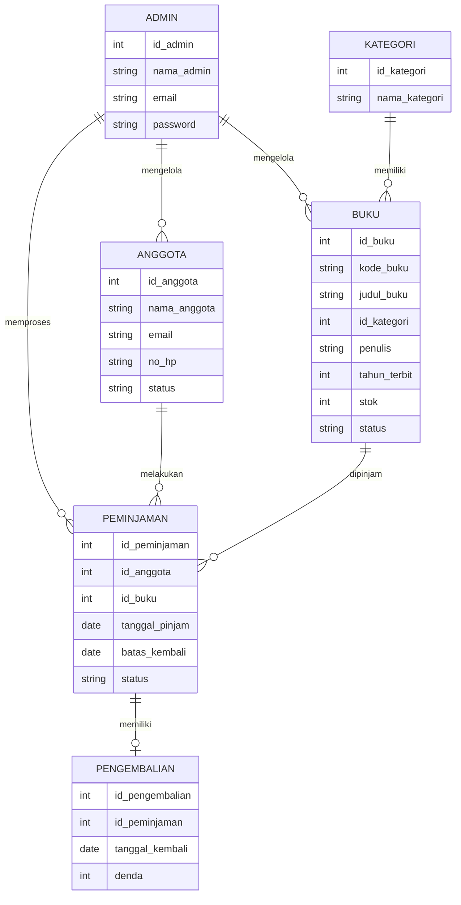
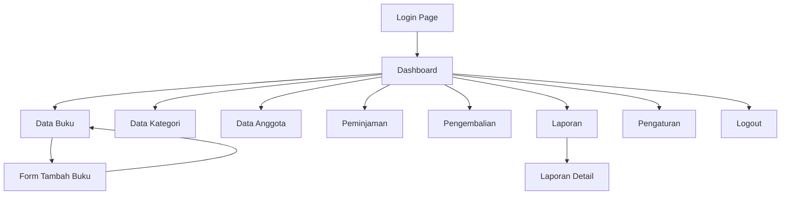

# PERANCANGAN ADMIN PANEL E-LIBRARY

## 1. Nama Project
E-Library Admin Panel

## 2. Topik
Sistem Informasi Perpustakaan Digital atau E-Library.

## 3. Deskripsi Singkat
E-Library Admin Panel adalah antarmuka back-office untuk mengelola data perpustakaan digital. Admin dapat melihat dashboard, mengelola data buku, kategori, anggota, peminjaman, pengembalian, laporan, dan pengaturan sistem.

Project ini berfokus pada client-side programming. Data yang digunakan berupa mock data JavaScript dan belum memakai database server.

## 4. Tema Visual
Tema yang digunakan adalah Material Design.

Ciri desain:
- Warna utama biru.
- Sidebar di sebelah kiri.
- Topbar berisi search, notifikasi, dan profil admin.
- Card statistik.
- Tabel data.
- Form input.
- Badge status.
- Komponen interaktif berbasis JavaScript.

## 5. Link Figma
https://www.figma.com/design/8lDGe5FSbMBeEAfj1JYkcC/E-Library?node-id=1-2&t=nFy6U7MnzMPo4YpF-1

## 6. Hirarki Menu
- Dashboard
- Data Buku
- Data Kategori
- Data Anggota
- Peminjaman
- Pengembalian
- Laporan
- Pengaturan
- Logout

## 7. Halaman yang Dibuat
- Login Page
- Dashboard Page
- Data Buku Page
- Form Tambah Buku Page
- Data Kategori Page
- Data Anggota Page
- Peminjaman Page
- Pengembalian Page
- Laporan Peminjaman Page
- Laporan Detail Page
- Pengaturan Page

## 8. ERD Sederhana

## 9. User Flow

## 10. Teknologi
- HTML5
- CSS3
- JavaScript
- Mock data
- Local client-side interaction

## Revisi Tambahan
- Logo login diganti dengan logo Universitas Pamulang.
- Dataset diperbesar menjadi 14 kategori, 700 buku, dan 50 anggota.
- Search, notifikasi, pagination, export Excel, grafik, dan dashboard dibuat sinkron dengan data mock di localStorage.
